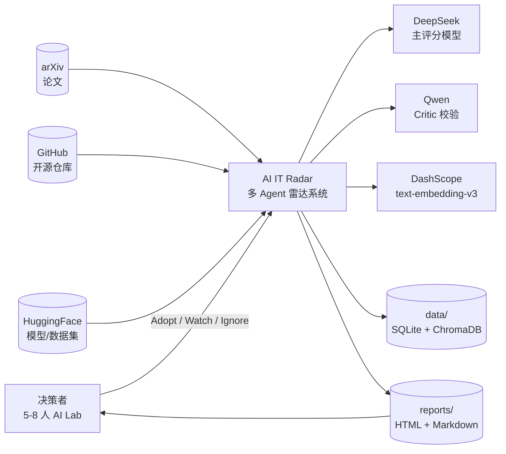
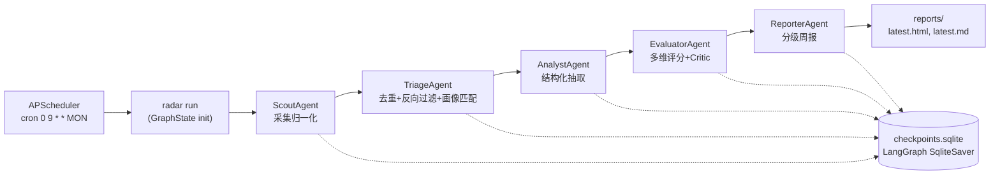
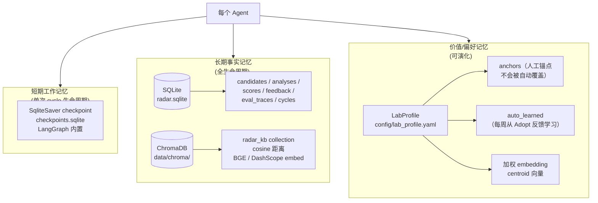
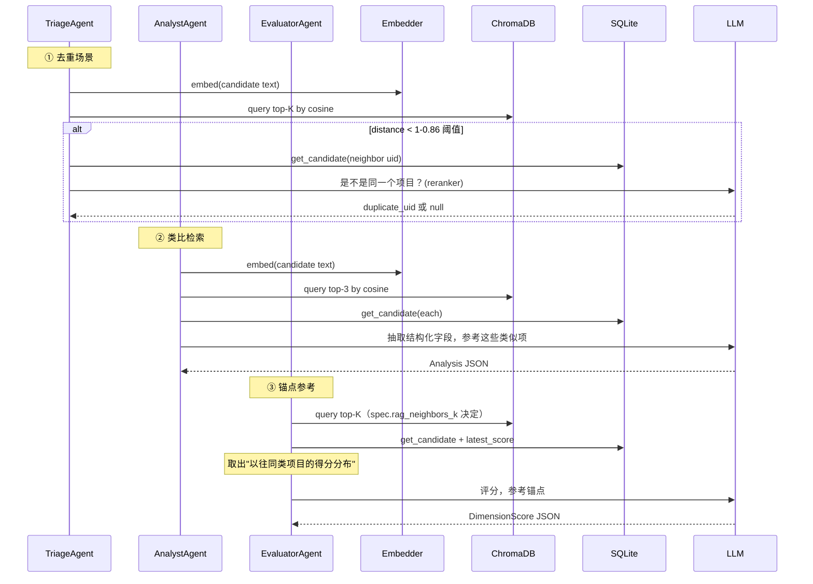
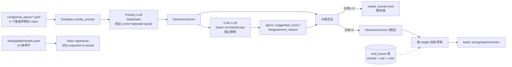
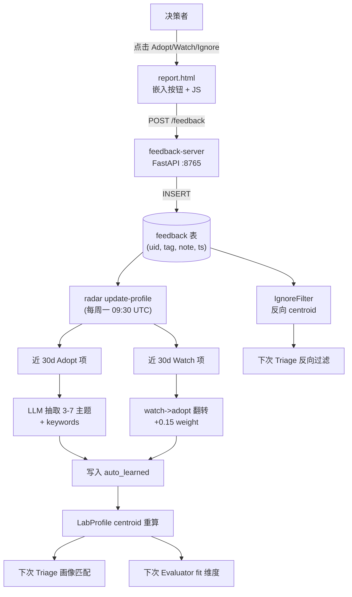
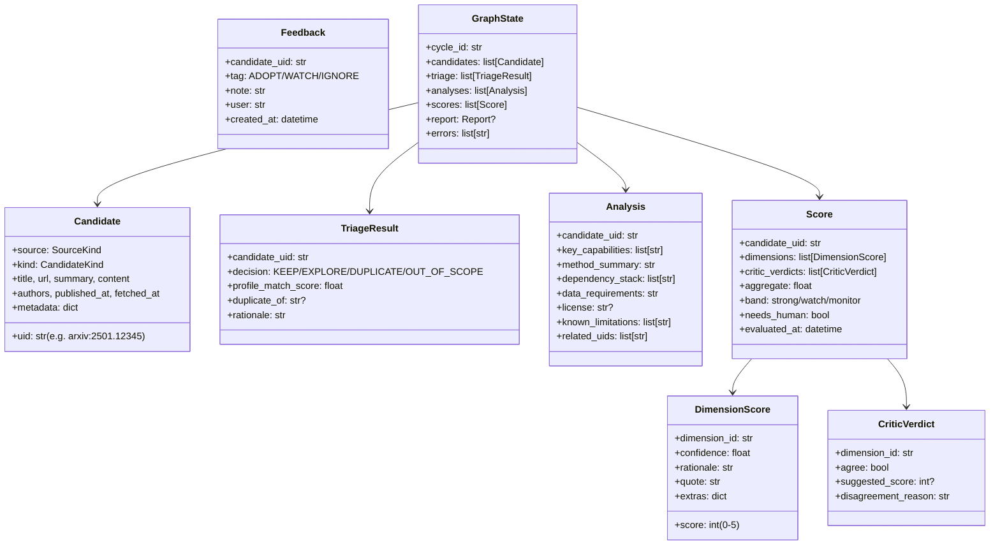
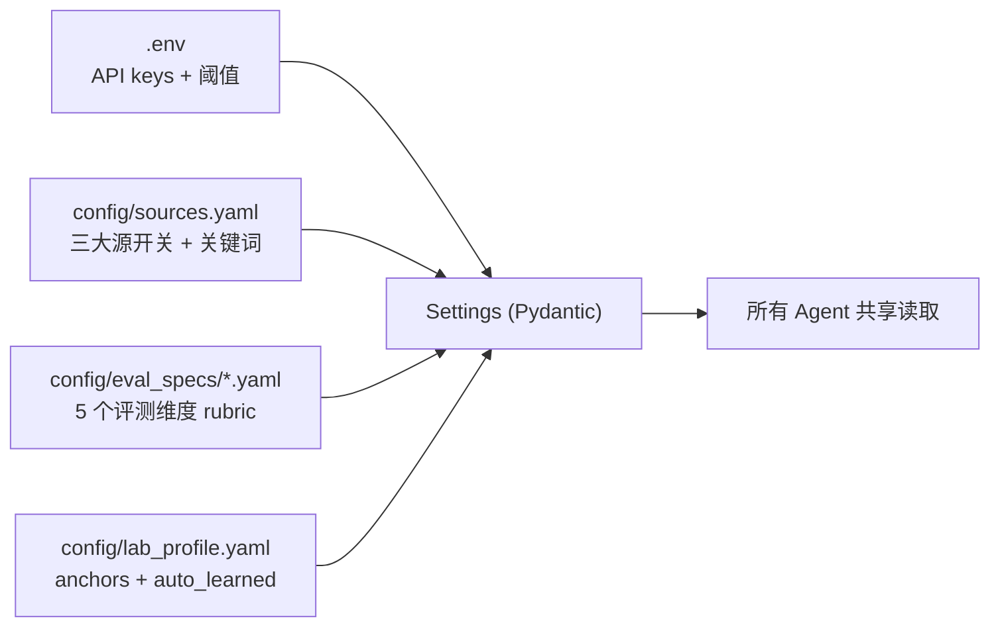
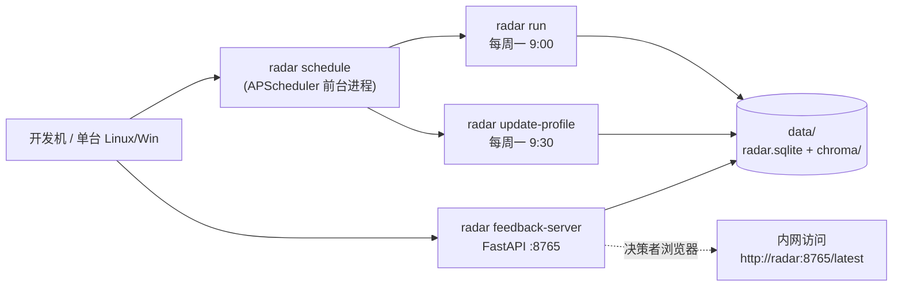

# 架构文档 — AI IT Radar

本文回答"系统是怎么搭起来的"。设计决策的 _why_ 见 [design.md](design.md)，运维的 _how_ 见 [operations.md](operations.md)。

## 1. 系统定位

为 5–8 人内部 AI Lab 提供常态化的"技术情报雷达"：

- **持续扫描** AI 社区动态（arXiv / GitHub Trending / HuggingFace Trending）
- **智能筛选** 用 RAG 去重 + Lab 兴趣画像匹配
- **多维评测** 用 LLM 在 5 个维度上评分（新颖性 / 工程成熟度 / Lab 匹配度 / 复现成本 / 风险），辅以 Critic 二次校验
- **分级周报** 输出"强烈推荐 / 关注 / 观望"三档 HTML+Markdown 报告
- **反馈闭环** 决策者点 Adopt / Watch / Ignore，反哺画像与负向过滤

明确不做的事（保留升级路径）：

- 不真跑模型 / 不跑 benchmark（L1 harness — 仅静态 / 文本层评测）
- 不做多用户权限 / IM 实时推送 / 中文社区源（MVP 后扩展）

## 2. 系统总览（C4 — Context Level）



## 3. 多 Agent 流水线（LangGraph 拓扑）

每周（或手动）触发一次 cycle，五个 Agent 节点串行执行；每个节点的 state 都通过 `SqliteSaver` checkpoint 持久化，崩溃可断点续跑。



**为什么是 LangGraph 而非 CrewAI / AutoGen** —— 见 [design.md §1](design.md#1-编排框架langgraph-vs-crewai--autogen)。

### 各 Agent 职责

| Agent | 输入 | 输出 | 关键依赖 |
|---|---|---|---|
| **Scout** | 配置（启用哪些源） | `list[Candidate]` | `arxiv` PyPI / `httpx` / `huggingface_hub` |
| **Triage** | `list[Candidate]` | 保留项 + 决策记录 | embedder, KB, LabProfile, IgnoreFilter, LLMReranker |
| **Analyst** | 保留项 | `list[Analysis]`（结构化字段） | LLM, RAG retriever |
| **Evaluator** | 保留项 + Analyses | `list[Score]`（5 维 + Critic + 聚合） | LLM, Critic LLM, EvalSpec, RAG retriever |
| **Reporter** | KB 中过去 7 天评分 | `Report` + 渲染文件 | Jinja2 templates |

代码位置：[src/ai_it_radar/agents/](../src/ai_it_radar/agents/)

## 4. 三层记忆系统



代码位置：[src/ai_it_radar/memory/](../src/ai_it_radar/memory/)

| 层 | 何时写 | 何时读 | 何时清 |
|---|---|---|---|
| 短期 | 每个 Agent 节点结束 | 同一 cycle 内 resume 时 | 自然过期（无 GC，但占用极小） |
| 长期 SQL | Triage 写候选 / Analyst 写分析 / Evaluator 写评分 / 反馈写入 | Reporter 拉周期评分 / RAG 取候选元数据 | 手动 |
| 长期 Vector | 与 SQL 同步 upsert | Triage 去重 / Analyst 类比 / Evaluator 锚点 | 手动 |
| 偏好 | `radar update-profile` / 人工编辑 anchors | 每次 Triage / Evaluator | 永不（anchors 不变；auto_learned 每周覆写） |

## 5. RAG 三处召回

向量库 `radar_kb` 在三个场景被不同方式利用：



代码位置：[src/ai_it_radar/rag/](../src/ai_it_radar/rag/) + 各 Agent 中的调用点。

**距离度量**：ChromaDB 显式设为 `hnsw:space=cosine`（[memory/kb.py:71](../src/ai_it_radar/memory/kb.py)），归一化向量上 0=完全相同、2=完全相反。

## 6. 评测 Harness（L1 轻量但可回归）

虽然不真跑模型，但保留了 harness 的"声明式 + 可回归"思想：



代码位置：[src/ai_it_radar/harness/](../src/ai_it_radar/harness/)

### 三重防幻觉

1. **强制引用** —— 每个 prompt 都要求"必须从 README/abstract 引一段原话"，quote 字段写入 SQLite
2. **Critic 独立审核** —— 主评分 (DeepSeek) 与 Critic (Qwen) 故意用不同模型家族
3. **配对比较** —— [harness/pairwise.py](../src/ai_it_radar/harness/pairwise.py) 提供"A vs B 谁更强"的相对判断（比绝对打分更稳定，主要供未来扩展使用）

### 黄金集回归

`tests/golden/seeds.yaml` 24 条覆盖 `strong_recommend / watch / monitor` 三档极值（vllm / Llama3 / LangGraph 是 strong；AutoGen / TinyLlama 是 watch；abandoned-toy / nft-llm / closed-source-paper 是 monitor）。任意改 prompt 后跑 `radar regression`，drift 超阈值非零退出。

## 7. 反馈闭环



代码位置：[src/ai_it_radar/feedback/](../src/ai_it_radar/feedback/) + [src/ai_it_radar/reporter/feedback_server.py](../src/ai_it_radar/reporter/feedback_server.py)

### Adopt / Watch / Ignore 各自的下游

| 反馈 | 立即效果 | 周期效果 |
|---|---|---|
| **Adopt** | 入 SQLite | LLM 抽主题进 `auto_learned`，影响下次 profile 匹配与 fit 评分 |
| **Watch** | 入 SQLite | 单独无作用；若后续翻 Adopt，对应主题 +0.15 权重（"延迟价值"信号） |
| **Ignore** | 入 SQLite | 进入 `IgnoreFilter` 反向 centroid，下次相似项被 Triage 直接 OUT_OF_SCOPE |

## 8. 数据模型

所有跨节点状态都用 Pydantic 强类型化：



代码位置：[src/ai_it_radar/schemas.py](../src/ai_it_radar/schemas.py)

## 9. 配置层级



| 文件 | 内容 | 谁更新 |
|---|---|---|
| `.env` | LLM/embedding API key、阈值参数、`RADAR_*` 环境变量 | 人工 |
| `config/sources.yaml` | 源启用开关、关键词、配额 | 人工 |
| `config/eval_specs/*.yaml` | 5 个维度的 rubric + prompt 模板 | 人工，prompt 调优时改 |
| `config/lab_profile.yaml` | `anchors`（不变） + `auto_learned`（自动覆写） | 人工写 anchors，`radar update-profile` 写 auto_learned |

## 10. 可观测性

| 层 | 工具 | 数据位置 |
|---|---|---|
| **运行日志** | Python `logging` (stderr) | 控制台输出，可 redirect 到文件 |
| **评测过程** | `eval_traces` 表 | SQLite —— 每个 prompt + raw response + critic + neighbors |
| **去重决策** | TriageResult.rationale | 写入 GraphState（cycle 结束后失访，未持久化）— 改进点 |
| **画像演化** | `lab_profile.yaml` git diff | 每次 update-profile 后 commit 即可看历史 |
| **反馈历史** | `feedback` 表 | SQLite —— 任何时候都可查 |

便捷查询：
```bash
sqlite3 data/radar.sqlite "SELECT dimension_id, raw_response, critic_response FROM eval_traces ORDER BY id DESC LIMIT 10"
```

## 11. 部署形态（MVP）



零运维基线：
- 全部数据落本地文件（SQLite + ChromaDB persistent）
- 无需独立数据库 / 消息队列 / Kubernetes
- 单机进程内嵌 APScheduler

## 12. 模块依赖（包级）

```mermaid
flowchart TB
    cli["cli.py<br/>(Typer)"] --> graph["graph.py<br/>(LangGraph 装配)"]
    cli --> scheduler["scheduler.py<br/>(APScheduler)"]
    cli --> feedback["feedback/"]
    cli --> harness["harness/"]

    graph --> agents["agents/<br/>scout/triage/analyst/<br/>evaluator/reporter"]
    graph --> memory["memory/<br/>short_term/kb/profile"]
    graph --> schemas["schemas.py"]

    agents --> rag["rag/<br/>embedder/indexer/<br/>retriever/reranker"]
    agents --> sources["sources/<br/>arxiv/github/hf"]
    agents --> harness
    agents --> feedback
    agents --> llm["llm.py"]
    agents --> memory

    rag --> memory
    feedback --> memory
    harness --> llm
    harness --> memory

    settings["settings.py<br/>(Pydantic Settings)"]
    llm --> settings
    rag --> settings
    memory --> settings
    sources --> settings
```

下游依赖：
- LangGraph + langchain-openai
- ChromaDB + sentence-transformers (BGE 备用) + langchain-community.embeddings.DashScope
- Pydantic v2 + pydantic-settings
- httpx + arxiv + huggingface_hub + beautifulsoup4
- FastAPI + uvicorn + Jinja2
- APScheduler + Typer + Rich

完整依赖：[pyproject.toml](../pyproject.toml)

## 13. 边界与限制

明确的"做不到"列表（见 [design.md §12](design.md#12-已知局限与未来工作)）：

- 不做实时（cycle 触发是周/天级，不是秒级）
- 不真跑模型（L2/L3 harness 是后续 sprint）
- 不做反向中文社区源（B 站 / 知乎 / 微博）
- 不做多用户权限（Lab 内部全员同一身份）
- 单机文件存储，不支持多机并发写

如需突破，参见 [extending.md](extending.md)。
